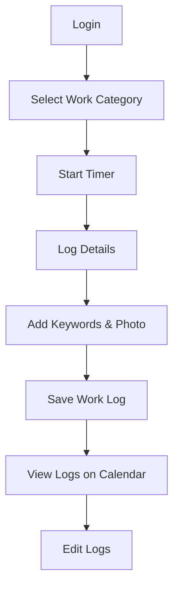

# Time Tracking App Plan

## Project Overview
The aim is to develop a React Native application for tracking worker hours. This app will provide functionalities for logging in, tracking time, categorizing work, recording specific details, and reviewing or editing logged work via a calendar interface.

---

## Features

### 1. User Authentication
- **Login Screen**: Users log in with credentials to access the app.

### 2. Time Tracking
- **Work Category Selection**: Users choose a category for the type of work being performed.
- **Time Logging**: Users input the amount of time spent on a specific task.
- **Details Entry**:
  - Add keywords describing the work.
  - Upload a picture related to the work.

### 3. Calendar Integration
- **View Logged Work**: Display completed tasks and associated details by date.
- **Edit Work Logs**: Modify work hours or details if necessary.

---

## Mermaid Flowchart

---

## Technology Stack
- **Frontend**: React Native
- **Backend**: TBD (e.g., Node.js, Firebase, or similar for managing data)
- **Database**: TBD (e.g., SQLite, Firestore, or similar for storing work logs)

---

## Next Steps
1. Finalize UI/UX design.
2. Define backend architecture.
3. Develop and integrate features iteratively.
4. Test and refine functionalities.

---

## Additional Notes
This app is designed to streamline work tracking for better productivity and accountability. Consider implementing offline support and notifications for reminders to log work.
